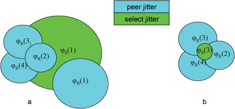

Clock Cluster Algorithm
=======================

The clock cluster algorithm processes the truechimers produced by the
clock select algorithm to produce a list of *survivors*. These survivors
are used by the mitigation algorithms to discipline the system clock.
The cluster algorithm operates in a series of rounds, where at each
round the truechimer furthest from the offset centroid is pruned from
the population. The rounds are continued until a specified termination
condition is met. This page discusses the algorithm in detail.

First, the truechimer associations are saved on an unordered list with
each candidate entry identified with index *i* (*i* = 1, ..., *n)*,
where *n* is the number of candidates. Let θ(\ *i*), be the offset and
λ(\ *i*) be the root distance of the *i*\ th entry. Recall that the root
distance is equal to the root dispersion plus half the root delay. For
the *i*\ th candidate on the list, a statistic called the *select
jitter* relative to the *i*\ th candidate is calculated as follows. Let

.. rst-class:: centered

  *d*\ :sub:`i`\ (*j*) = \|θ(\ *j*) − θ(\ *i*)\| λ(\ *i*),

where θ(\ *i)* is the peer offset of the *i*\ th entry and θ(\ *j*) is
the peer offset of the *j*\ th entry, both produced by the clock filter
algorithm. The metric used by the cluster algorithm is the select jitter
φ\ :sub:`S`\ (*i*) computed as the root mean square (RMS) of the
*d*\ :sub:`i`\ (*j*) as *j* ranges from 1 to *n*. For the purpose of
notation in the example to follow, let φ\ :sub:`R`\ (*i*) be the peer
jitter computed by the clock filter algorithm for the *i*\ th candidate.

The object at each round is to prune the entry with the largest metric
until the termination condition is met. Note that the select jitter must
be recomputed at each round, but the peer jitter does not change. At
each round the remaining entries on the list represent the survivors of
that round. If the candidate to be pruned is preemptable and the number
of candidates is greater than the *maxclock threshold*, the association
is demobilized. This is useful in the schemes described on the
:doc:`discover` page. The maxclock threshold default is 10, but it can be
changed using the ``maxclock`` option of the :ref:`tos <miscopt-tos>` command.
Further pruning is subject to the following termination conditions, but
no associations will be automatically demobilized.

The termination condition has two parts. First, if the number of
survivors is not greater than the *minclock threshold* set by the
``minclock`` option of the :ref:`tos <miscopt-tos>` command,
the pruning process terminates. The ``minclock`` default is 3, but can be
changed to fit special conditions, as described on the :doc:`prefer` page.

  Figure 1. Cluster Algorithm

The second termination condition is more intricate. Figure 1 shows a
round where a candidate of (a) is pruned to yield the candidates of (b).
Let φ\ :sub:`max` be the maximum select jitter and φ\ :sub:`min` be
the minimum peer jitter over all candidates on the list. In (a),
candidate 1 has the highest select jitter, so φ\ :sub:`max` =
φ\ :sub:`S`\ (1). Candidate 4 has the lowest peer jitter, so
φ\ :sub:`min` = φ\ :sub:`R`\ (4). Since φ\ :sub:`max` >
φ\ :sub:`min`, select jitter dominates peer jitter,the algorithm
prunes candidate 1. In (b), φ\ :sub:`max` = φ\ :sub:`S`\ (3) and
φ\ :sub:`min` =φ\ :sub:`R`\ (4). Since φ\ :sub:`max` <
φ\ :sub:`min`, pruning additional candidates does not reduce select
jitter, the algorithm terminates with candidates 2, 3 and 4 as
survivors.

The survivor list is passed on to the the mitigation algorithms, which
combine the survivors, select a system peer, and compute the system
statistics passed on to dependent clients. Note the use of root distance
λ as a weight factor at each round in the clock cluster algorithm. This
is to favor the survivors with the lowest root distance and thus the
smallest maximum error.
