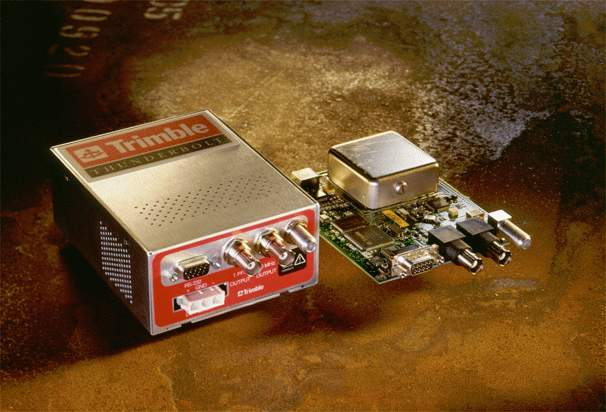

Trimble Palisade and Thunderbolt Receivers
==========================================

+--------------------------------------+--------------------------------------+
| .. rubric::                          | .. rubric::                          |
|                                      |                                      |
| |image0|                             | |jpg|                                |
|                                      |                                      |
| .. raw:: html                        | .. raw:: html                        |
|                                      |                                      |
|    </h2>                             |    </h2>                             |
+--------------------------------------+--------------------------------------+

Synopsis
--------

+--------------------------------------+--------------------------------------+
| .. raw:: html                        | **127.127.29.\ *u***                 |
|                                      |                                      |
|    
               |                                      |
|                                      |                                      |
| ``Address: ``                        |                                      |
|                                      |                                      |
| .. raw:: html                        |                                      |
|                                      |                                      |
|    
                            |                                      |
+--------------------------------------+--------------------------------------+
| .. raw:: html                        | SPHINX-LABELREFIDSPHINX-LABEL\ **GPS |
|                                      | **                                   |
|    
               |                                      |
|                                      |                                      |
| ``Reference ID:``                    |                                      |
|                                      |                                      |
| .. raw:: html                        |                                      |
|                                      |                                      |
|    
                            |                                      |
+--------------------------------------+--------------------------------------+
| .. raw:: html                        | **GPS\_PALISADE**                    |
|                                      |                                      |
|    
               |                                      |
|                                      |                                      |
| ``Driver ID:``                       |                                      |
|                                      |                                      |
| .. raw:: html                        |                                      |
|                                      |                                      |
|    
                            |                                      |
+--------------------------------------+--------------------------------------+
| .. raw:: html                        | **/dev/palisade*u***                 |
|                                      |                                      |
|    
               |                                      |
|                                      |                                      |
| ``Serial Port:``                     |                                      |
|                                      |                                      |
| .. raw:: html                        |                                      |
|                                      |                                      |
|    
                            |                                      |
+--------------------------------------+--------------------------------------+
| .. raw:: html                        | **9600 baud, 8-bits, 1-stop, odd     |
|                                      | parity**                             |
|    
               |                                      |
|                                      |                                      |
| ``Serial I/O:``                      |                                      |
|                                      |                                      |
| .. raw:: html                        |                                      |
|                                      |                                      |
|    
                            |                                      |
+--------------------------------------+--------------------------------------+
| .. raw:: html                        | **9600 baud, 8-bits, 1-stop, no      |
|                                      | parity**                             |
|    
               |                                      |
|                                      |                                      |
| ``Serial I/O (Thunderbolt):``        |                                      |
|                                      |                                      |
| .. raw:: html                        |                                      |
|                                      |                                      |
|    
                            |                                      |
+--------------------------------------+--------------------------------------+

Description
-----------

| The **refclock\_palisade** driver supports `Trimble Navigation's
  Palisade Smart Antenna GPS
  receiver <http://www.trimble.com/products/ntp>`__.
|  Additional software and information about the Palisade GPS is
  available from: http://www.trimble.com/oem/ntp.
|  Latest NTP driver source, executables and documentation is maintained
  at: ftp://ftp.trimble.com/pub/ntp

| This documentation describes version 7.12 of the GPS Firmware and
  version 2.46 (July 15, 1999) and later, of the driver source.
|  

This documentation describes version 1 of the Thunderbolt Receiver
Firmware, no tests have been made on further firmwares, please read
"Notes on the Thunderbolt Receiver's Firmware" at the end of this
documentation for more information.

Operating System Compatibility
------------------------------

| The Palisade driver has been tested on the following software and
  hardware platforms:
|  

.. raw:: html

   

+-------------------+--------------------+-------------------------------------+------------+
| Platform          | Operating System   | NTP Sources                         | Accuracy   |
+-------------------+--------------------+-------------------------------------+------------+
| i386 (PC)         | Linux              | NTP Distribution                    | 10 us      |
+-------------------+--------------------+-------------------------------------+------------+
| i386 (PC)         | Windows NT         | ftp://ftp.trimble.com/pub/ntp       | 1 ms       |
+-------------------+--------------------+-------------------------------------+------------+
| SUN               | Solaris 2.x        | NTP Distribution                    | 50 us      |
+-------------------+--------------------+-------------------------------------+------------+
| Hewlett-Packard   | HPUX 9, 10, 11     | http://us-support.external.hp.com   | 50 us      |
+-------------------+--------------------+-------------------------------------+------------+
| Various           | Free BSD           | NTP Distribution                    | 20 us      |
+-------------------+--------------------+-------------------------------------+------------+

.. raw:: html

   

**Attention**: Thunderbolt Receiver has not being tested on the previous
software and hardware plataforms.

GPS Receiver
------------

The Palisade GPS receiver is an 8-channel smart antenna, housing the GPS
receiver, antenna and interface in a single unit, and is designed for
rooftop deployment in static timing applications.

Palisade generates a PPS synchronized to UTC within +/- 100 ns.  The
Palisade's external event input with 40 nanosecond resolution is
utilized by the Palisade NTP driver for asynchronous precision time
transfer.

| No user initialization of the receiver is required. This driver is
  compatible with the following versions of Palisade:
|  

.. raw:: html

   

+--------------------------+--------------------------+--------------------------+
| .. raw:: html            | .. raw:: html            | .. raw:: html            |
|                          |                          |                          |
|    
              |    
              |    
              |
|                          |                          |                          |
| Version                  | Event Input              | Trimble Part Number      |
|                          |                          |                          |
| .. raw:: html            | .. raw:: html            | .. raw:: html            |
|                          |                          |                          |
|    
             |    
             |    
             |
+--------------------------+--------------------------+--------------------------+
| .. raw:: html            | .. raw:: html            | .. raw:: html            |
|                          |                          |                          |
|    
              |    
              |    
              |
|                          |                          |                          |
| 7.02                     | No                       | 26664-00                 |
|                          |                          |                          |
| .. raw:: html            | .. raw:: html            | .. raw:: html            |
|                          |                          |                          |
|    
             |    
             |    
             |
+--------------------------+--------------------------+--------------------------+
| .. raw:: html            | .. raw:: html            | .. raw:: html            |
|                          |                          |                          |
|    
              |    
              |    
              |
|                          |                          |                          |
| 7.02E                    | Yes                      | 26664-10                 |
|                          |                          |                          |
| .. raw:: html            | .. raw:: html            | .. raw:: html            |
|                          |                          |                          |
|    
             |    
             |    
             |
+--------------------------+--------------------------+--------------------------+
| .. raw:: html            | .. raw:: html            | .. raw:: html            |
|                          |                          |                          |
|    
              |    
              |    
              |
|                          |                          |                          |
| 7.12                     | Yes                      | 38158-00                 |
|                          |                          |                          |
| .. raw:: html            | .. raw:: html            | .. raw:: html            |
|                          |                          |                          |
|    
             |    
             |    
             |
+--------------------------+--------------------------+--------------------------+

.. raw:: html

   

.. raw:: html

   <dl>

.. raw:: html

   <dl>

Note: When using Palisade 26664-00, you must set fudge flag2 to 1 in
**ntp.conf**. See :ref:`configuration
<driver29-Configuration>`.

.. raw:: html

   </dl>

.. raw:: html

   <dl>

.. _driver29-Installation:

GPS Installation
~~~~~~~~~~~~~~~~~~~~~~~~~~~~~~~~~~~~~~~~~~~~~~~~~~~~

A location with unobstructed view of the horizon is recommended.
Palisade is designed to be securely mounted atop standard 3/4 inch
threaded pipe.

The 12 conductor (dia. 10 mm)  power and I/O cable must be routed from
the rooftop site to the NTP server and properly strain relieved.

GPS Connection
~~~~~~~~~~~~~~

The Palisade is equipped with dual (A & B) RS-422 serial interfaces and
a differential TTL PPS output. An RS-232 / RS-422 Interface Module is
supplied with the Palisade NTP Synchronization Kit. Palisade
:ref:`port A
<driver29-PortA>` must be connected to the NTP
host server. Maximum antenna cable length is 500 meters. See the
:ref:`pinouts
<driver29-Pinouts>` table for detailed
connection Information.

| Palisade's :ref:`port B
  <driver29-PortB>` provides a TSIP (Trimble
  Standard Interface Protocol) interface for diagnostics, configuration,
  and monitoring. Port B and the PPS output are not currently used by
  the Palisade NTP reference clock driver.
|  

.. raw:: html

   </dl>

.. raw:: html

   </dl>

O/S Serial Port Configuration
-----------------------------

The driver attempts to open the device
**:ref:`/dev/palisade
<driver29-REFID>`*u*** where ***u*** is the NTP
refclock unit number as defined by the LSB of the refclock address. 
Valid refclock unit numbers are 0 - 3.

The user is expected to provide a symbolic link to an available serial
port device.  This is typically performed by a command such as:

    ``ln -s /dev/ttyS0 /dev/palisade0``

| Windows NT does not support symbolic links to device files.
  COM\ **x**: is used by the driver, based on the refclock unit number,
  where unit 1 corresponds to COM\ **1**: and unit 3 corresponds to
  COM3:
|  

.. _driver29-Configuration:

NTP Configuration
------------------------------------------------------

| Palisade NTP configuration file **``"ntp.conf"``** with event polling:
| 
  ``#------------------------------------------------------------------------------``
|  ``# The Primary reference``
|  ``server 127.127.29.0 # Trimble Palisade GPS Refclock Unit #0``
|  ``peer terrapin.csc.ncsu.edu # internet server``
| 
  ``# Drift file for expedient re-synchronization after downtime or reboot.``
|  ``driftfile /etc/ntp.drift``
| 
  ``#------------------------------------------------------------------------------``

| Configuration without event polling:
| 
  ``#------------------------------------------------------------------------------``
|  ``# The Primary reference``
|  ``server 127.127.29.0 # Trimble Palisade GPS (Stratum 1).``
|  ``# Set packet delay``
|  :ref:`fudge 127.127.29.0 time1 0.020
  <driver29-time1>`
|  ``# and set flag2 to turn off event polling.``
|  :ref:`fudge 127.127.29.0 flag2 1
  <driver29-flag2>`
| 
  ``#------------------------------------------------------------------------------``
|  

Thunderbolt NTP Configuration file
~~~~~~~~~~~~~~~~~~~~~~~~~~~~~~~~~~

``#------------------------------------------------------------------------------``

| Configuration without event polling:
| 
  ``#------------------------------------------------------------------------------``
|  ``# The Primary reference``
|  ``server 127.127.29.0 mode 2 # Trimble Thunderbolt GPS (Stratum 1).``
|  ``# Set packet delay``
|  :ref:`fudge 127.127.29.0 time1 0.020
  <driver29-time1>`
|  ``# and set flag2 to turn off event polling.``
|  :ref:`fudge 127.127.29.0 flag2 1
  <driver29-flag2>`
| 
  ``#------------------------------------------------------------------------------``
|  

Currently the Thunderbolt mode doesn't support event polling, the
reasons are explained on the "Notes on the Thunderbolt Receiver's
Firmware" section at the end of this documentation.

.. _driver29-TimeTransfer:

Time Transfer and Polling
-------------------------------------------------------------

Time transfer to the NTP host is performed via the Palisade's
comprehensive time packet output. The time packets are output once per
second, and whenever an event timestamp is requested.

The driver requests an event time stamp at the end of each polling
interval, by pulsing the RTS (request to send) line on the serial port.
The Palisade GPS responds with a time stamped event packet.

| Time stamps are reported by the Palisade with respect to UTC time. The
  GPS receiver must download UTC offset information from GPS satellites.
  After an initial UTC download, the receiver will always start with
  correct UTC offset information.
|  

Run NTP in Debugging Mode
-------------------------

The following procedure is recommended for installing and testing a
Palisade NTP driver:

#. Perform initial checkout procedures. Place the GPS receiver outdoors;
   with clear view of the sky. Allow the receiver to obtain an UTC
   almanac.
#. Verify presence of timing packets by observing the 1 Hz (PPS) led on
   the interface module. It should flash once per second.
#. Connect Palisade's port A to the NTP host.
#. Configure NTP and the serial I/O port on the host system.
#. Initially use :ref:`fudge flag2
   <driver29-flag2>` in
   **:ref:`ntp.conf
   <driver29-Configuration>`,** to disable
   event polling (see configuration).
#. Run NTP in debug mode (-d -d), to observe Palisade\_receive events.
#. The driver reports the :ref:`tracking status
   of the receiver <driver29-TrackingStatus>`.
   Make sure it is tracking several satellites.
#. Remove fudge flag2 and restart **ntpd** in debug mode to observe
   palisade\_receive events.
#. If event polling fails, verify the
   :ref:`connections
   <driver29-Pinouts>` and that the host
   hardware supports RTS control.

Event Logging
-------------

System and Event log entries are generated by NTP to report significant
system events. Administrators should monitor the system log to observe
NTP error messages. Log entries generated by the Palisade NTP reference
clock driver will be of the form:

    ::

        Nov 14 16:16:21 terrapin ntpd[1127]: Palisade #0: message

Fudge Factors
-------------

.. _driver29-time1:

``:ref:`time1  <driver29-Configuration>`time``
    Specifies the time offset calibration factor, in seconds and
    fraction, with default 0.0. If event capture is not used, time1
    should be set to 20 milliseconds to correct serial line and
    operating system delays incurred in capturing time stamps from the
    synchronous packets.
``stratum number``
    Specifies the driver stratum, in decimal from 0 to 15, with default
    0.
``:ref:`refid  <driver29-REFID>`string``
    Specifies the driver reference identifier, **GPS**.
SPHINX-LABELflag2><tt>`
    When set to 1, driver does not use hardware event capture. The
    synchronous packet output by the receiver at the beginning of each
    second is time stamped by the driver. If triggering the event pulse
    fails, the driver falls back to this mode automatically.

Mode Parameter
--------------

``mode number``
    The mode parameter to the server command specifies the specific
    hardware this driver is for. The default is 0 for a normal Trimble
    Palisade. The other options are **1** for an **Endrun Praecis** in
    Trimble emulation mode, and **2** for the **Trimble Thunderbolt**
    GPS Disciplined Clock Receiver.

DEFINEs
-------

| The following constants are defined in the driver source code. These
  defines may be modified to improve performance or adapt to new
  operating systems.
|  

.. raw:: html

   

+------------------+---------------------------------------------------+------------------------+
| **Label**        | Definition                                        | Default Value          |
+------------------+---------------------------------------------------+------------------------+
| DEVICE           | The serial port device to be used by the driver   | /dev/palisade***u***   |
+------------------+---------------------------------------------------+------------------------+
| PRECISION        | Accuracy of time transfer                         | 1 microsecond          |
+------------------+---------------------------------------------------+------------------------+
| CURRENT\_UTC     | Valid GPS - UTC offset                            | 13                     |
+------------------+---------------------------------------------------+------------------------+
| SPEED232         | Host RS-232 baud rate                             | B9600                  |
+------------------+---------------------------------------------------+------------------------+
| TRMB\_MINPOLL    | Minimum polling interval                          | 5 (32 seconds)         |
+------------------+---------------------------------------------------+------------------------+
| TRMB\_MAXPOLL    | Maximum interval between polls                    | 7 (128 seconds)        |
+------------------+---------------------------------------------------+------------------------+

.. raw:: html

   

.. _driver29-DataFormat:

Data Format
---------------------------------------------

Palisade port A can output two synchronous time packets. The NTP driver
can use either packet for synchronization. Packets are formatted as
follows:

**Packet 8F-AD (Primary NTP Packet)**
~~~~~~~~~~~~~~~~~~~~~~~~~~~~~~~~~~~~~

.. raw:: html

   

+-----------+---------------------+-----------+-------------------------------------------+
| Byte      | Item                | Type      | Meaning                                   |
+-----------+---------------------+-----------+-------------------------------------------+
| 0         | Sub-Packet ID       | BYTE      | Subcode 0xAD                              |
+-----------+---------------------+-----------+-------------------------------------------+
| 1 - 2     | Event Count         | INTEGER   | External event count recorded (0 = PPS)   |
+-----------+---------------------+-----------+-------------------------------------------+
| 3 - 10    | Fractional Second   | DOUBLE    | Time elapsed in current second (s)        |
+-----------+---------------------+-----------+-------------------------------------------+
| 11        | Hour                | BYTE      | Hour (0 - 23)                             |
+-----------+---------------------+-----------+-------------------------------------------+
| 12        | Minute              | BYTE      | Minute (0 - 59)                           |
+-----------+---------------------+-----------+-------------------------------------------+
| 13        | Second              | BYTE      | Second (0 - 59; 60 = leap)                |
+-----------+---------------------+-----------+-------------------------------------------+
| 14        | Day                 | BYTE      | Date (1 - 31)                             |
+-----------+---------------------+-----------+-------------------------------------------+
| 15        | Month               | BYTE      | Month (1 - 12)                            |
+-----------+---------------------+-----------+-------------------------------------------+
| 16 - 17   | Year                | INTEGER   | Year (4 digit)                            |
+-----------+---------------------+-----------+-------------------------------------------+
| 18        | Receiver Status     | BYTE      | Tracking Status                           |
+-----------+---------------------+-----------+-------------------------------------------+
| 19        | UTC Flags           | BYTE      | Leap Second Flags                         |
+-----------+---------------------+-----------+-------------------------------------------+
| 20        | Reserved            | BYTE      | Contains 0xFF                             |
+-----------+---------------------+-----------+-------------------------------------------+
| 21        | Reserved            | BYTE      | Contains 0xFF                             |
+-----------+---------------------+-----------+-------------------------------------------+

.. raw:: html

   

Leap Second Flag Definition:
^^^^^^^^^^^^^^^^^^^^^^^^^^^^

| Bit 0:  (1) UTC Time is available
|  Bits 1 - 3: Undefined
|  Bit 4:  (1) Leap Scheduled: Leap second pending asserted by GPS
  control segment.
|  Bit 5:  (1) Leap Pending: set 24 hours before, until beginning of
  leap second.
|  Bit 6:  (1) GPS Leap Warning: 6 hours before until 6 hours after leap
  event
|  Bit 7:  (1) Leap In Progress. Only set during the leap second.

.. _driver29-TrackingStatus:

Tracking Status Flag Definitions:
^^^^^^^^^^^^^^^^^^^^^^^^^^^^^^^^^^^^^^^^^^^^^^^^^^^^^^^^^^^^^^^^^^^^^^^

.. raw:: html

   

+--------+-----------------------------------------+--------------+-----------------------+
| Code   | Meaning                                 | Accuracy     | Receiver Mode         |
+--------+-----------------------------------------+--------------+-----------------------+
| 0      | Receiver is Navigating                  | +/- 1 us     | Self Survey           |
+--------+-----------------------------------------+--------------+-----------------------+
| 1      | Static 1 Sat. Timing Mode               | +/- 1 us     | 1-D Timing            |
+--------+-----------------------------------------+--------------+-----------------------+
| 2      | Approximate Time                        | 20 - 50 ms   | Acquisition           |
+--------+-----------------------------------------+--------------+-----------------------+
| 3      | Startup                                 | N/A          | Initialization        |
+--------+-----------------------------------------+--------------+-----------------------+
| 4      | Startup                                 | N/A          | Initialization        |
+--------+-----------------------------------------+--------------+-----------------------+
| 5      | Dilution of Position too High           | 5 ppm        | Self Survey           |
+--------+-----------------------------------------+--------------+-----------------------+
| 6      | Static 1 Sat. Timing: Sat. not usable   | 5 ppm        | 1-D Timing            |
+--------+-----------------------------------------+--------------+-----------------------+
| 7      | No Satellites Usable                    | N/A          | Self Survey           |
+--------+-----------------------------------------+--------------+-----------------------+
| 8      | Only 1 Satellite Usable                 | 20 - 50 ms   | Self Survey           |
+--------+-----------------------------------------+--------------+-----------------------+
| 9      | Only 2 Satellite Usable                 | 20 - 50 ms   | Self Survey           |
+--------+-----------------------------------------+--------------+-----------------------+
| 10     | Only 3 Satellites Usable                | 20 - 50 ms   | Self Survey           |
+--------+-----------------------------------------+--------------+-----------------------+
| 11     | Invalid Solution                        | N/A          | Error                 |
+--------+-----------------------------------------+--------------+-----------------------+
| 12     | Differential Corrections                | N/A          | N/A                   |
+--------+-----------------------------------------+--------------+-----------------------+
| 13     | Overdetermined Fixes                    | +/- 100 ns   | Timing Steady State   |
+--------+-----------------------------------------+--------------+-----------------------+

.. raw:: html

   

**Packet 8F-0B (Comprehensive Timing Packet)**
~~~~~~~~~~~~~~~~~~~~~~~~~~~~~~~~~~~~~~~~~~~~~~

.. raw:: html

   

+-----------+-------------------------+-----------+----------------------------------------------+
| Byte      | Item                    | Type      | Meaning                                      |
+-----------+-------------------------+-----------+----------------------------------------------+
| 0         | Sub-Packet ID           | BYTE      | Subcode 0x0B                                 |
+-----------+-------------------------+-----------+----------------------------------------------+
| 1 - 2     | Event Count             | INTEGER   | External event count recorded (0 = PPS)      |
+-----------+-------------------------+-----------+----------------------------------------------+
| 3 - 10    | UTC / GPS TOW           | DOUBLE    | UTC / GPS time of week (seconds)             |
+-----------+-------------------------+-----------+----------------------------------------------+
| 11        | Date                    | BYTE      | Day of Month                                 |
+-----------+-------------------------+-----------+----------------------------------------------+
| 12        | Month                   | BYTE      | Month of Event                               |
+-----------+-------------------------+-----------+----------------------------------------------+
| 13 - 14   | Year                    | INT       | Year of event                                |
+-----------+-------------------------+-----------+----------------------------------------------+
| 15        | Receiver Mode           | BYTE      | Receiver operating dimensions:               |
|           |                         |           | 0: Horizontal (2D)                           |
|           |                         |           | 1: Full Position (3D)                        |
|           |                         |           | 2: Single Satellite (0D)                     |
|           |                         |           | 3: Automatic (2D / 3D)                       |
|           |                         |           | 4: DGPS reference                            |
|           |                         |           | 5: Clock hold (2D)                           |
|           |                         |           |  6: Over determined Clock                    |
+-----------+-------------------------+-----------+----------------------------------------------+
| 15 - 17   | UTC Offset              | INTEGER   | UTC Offset value (seconds)                   |
+-----------+-------------------------+-----------+----------------------------------------------+
| 18 - 25   | Oscillator Bias         | DOUBLE    | Oscillator BIAS (meters)                     |
+-----------+-------------------------+-----------+----------------------------------------------+
| 26 - 33   | Oscillator Drift Rate   | DOUBLE    | Oscillator Drift (meters / second)           |
+-----------+-------------------------+-----------+----------------------------------------------+
| 34 - 37   | Bias Uncertainty        | SINGLE    | Oscillator bias uncertainty (meters)         |
+-----------+-------------------------+-----------+----------------------------------------------+
| 38 - 41   | Drift Uncertainty       | SINGLE    | Oscillator bias rate uncertainty (m / sec)   |
+-----------+-------------------------+-----------+----------------------------------------------+
| 42 - 49   | Latitude                | DOUBLE    | Latitude in radians                          |
+-----------+-------------------------+-----------+----------------------------------------------+
| 50 - 57   | Longitude               | DOUBLE    | Longitude in radians                         |
+-----------+-------------------------+-----------+----------------------------------------------+
| 58 - 65   | Altitude                | DOUBLE    | Altitude above mean sea level, in meters     |
+-----------+-------------------------+-----------+----------------------------------------------+
| 66 - 73   | Satellite ID            | BYTE      | SV Id No. of tracked satellites              |
+-----------+-------------------------+-----------+----------------------------------------------+

.. raw:: html

   

Thunderbolt Timing packets Data Format
~~~~~~~~~~~~~~~~~~~~~~~~~~~~~~~~~~~~~~

Thunderbolt can output 2 synchronous packets.

**Primary Timing Packet - 0x8FAB**
^^^^^^^^^^^^^^^^^^^^^^^^^^^^^^^^^^

.. raw:: html

   

+--------------+--------------+--------------+--------------+--------------+--------------+
| **Byte**     | **Bit**      | **Item**     | **Type**     | **Value**    | **Descriptio |
|              |              |              |              |              | n**          |
+--------------+--------------+--------------+--------------+--------------+--------------+
| 0            |              | Subcode      | UINT8        |              | 0xAB         |
+--------------+--------------+--------------+--------------+--------------+--------------+
| 1-4          |              | Time of Week | UINT32       |              | GPS seconds  |
|              |              |              |              |              | of week      |
+--------------+--------------+--------------+--------------+--------------+--------------+
| 5-6          |              | Week Number  | UINT16       |              | GPS Week     |
|              |              |              |              |              | Number       |
+--------------+--------------+--------------+--------------+--------------+--------------+
| 7-8          |              | UTC Offset   | SINT16       |              | UTC Offset   |
|              |              |              |              |              | (seconds)    |
+--------------+--------------+--------------+--------------+--------------+--------------+
| 9            | +-----+      | Timing Flag  | Bit field    | +----------+ | +----------- |
|              | | 0   |      |              |              | | 0 or 1   | | ------------ |
|              | +-----+      |              |              | +----------+ | ------------ |
|              | | 1   |      |              |              | | 0 or 1   | | +            |
|              | +-----+      |              |              | +----------+ | | GPS Time o |
|              | | 2   |      |              |              | | 0 or 1   | | r UTC Time   |
|              | +-----+      |              |              | +----------+ |              |
|              | | 3   |      |              |              | | 0 or 1   | | |            |
|              | +-----+      |              |              | +----------+ | +----------- |
|              | | 4   |      |              |              | | 0 or 1   | | ------------ |
|              | +-----+      |              |              | +----------+ | ------------ |
|              |              |              |              |              | +            |
|              |              |              |              |              | | GPS PPS or |
|              |              |              |              |              |  UTC PPS     |
|              |              |              |              |              |              |
|              |              |              |              |              | |            |
|              |              |              |              |              | +----------- |
|              |              |              |              |              | ------------ |
|              |              |              |              |              | ------------ |
|              |              |              |              |              | +            |
|              |              |              |              |              | | time is se |
|              |              |              |              |              | t or time is |
|              |              |              |              |              |  not set     |
|              |              |              |              |              | |            |
|              |              |              |              |              | +----------- |
|              |              |              |              |              | ------------ |
|              |              |              |              |              | ------------ |
|              |              |              |              |              | +            |
|              |              |              |              |              | | have UTC i |
|              |              |              |              |              | nfo or no UT |
|              |              |              |              |              | C info       |
|              |              |              |              |              | |            |
|              |              |              |              |              | +----------- |
|              |              |              |              |              | ------------ |
|              |              |              |              |              | ------------ |
|              |              |              |              |              | +            |
|              |              |              |              |              | | Time from  |
|              |              |              |              |              | GPS or time  |
|              |              |              |              |              | from user    |
|              |              |              |              |              | |            |
|              |              |              |              |              | +----------- |
|              |              |              |              |              | ------------ |
|              |              |              |              |              | ------------ |
|              |              |              |              |              | +            |
+--------------+--------------+--------------+--------------+--------------+--------------+
| 10           |              | Seconds      | UINT8        | 0-59         | (60 for UTC  |
|              |              |              |              |              | leap second  |
|              |              |              |              |              | event)       |
+--------------+--------------+--------------+--------------+--------------+--------------+
| 11           |              | Minutes      | UINT8        | 0-59         | Minutes of   |
|              |              |              |              |              | Hour         |
+--------------+--------------+--------------+--------------+--------------+--------------+
| 12           |              | Hours        | UINT8        | 0-23         | Hour of Day  |
+--------------+--------------+--------------+--------------+--------------+--------------+
| 13           |              | Day of Month | UINT8        | 1-31         | Day of Month |
+--------------+--------------+--------------+--------------+--------------+--------------+
| 14           |              | Month        | UINT8        | 1-12         | Month of     |
|              |              |              |              |              | Year         |
+--------------+--------------+--------------+--------------+--------------+--------------+
| 15-16        |              | Year         | UINT16       |              | Four digits  |
|              |              |              |              |              | of Year      |
|              |              |              |              |              | (e.g. 1998)  |
+--------------+--------------+--------------+--------------+--------------+--------------+

.. raw:: html

   

**Supplemental Timing Packet - 0x8FAC**
^^^^^^^^^^^^^^^^^^^^^^^^^^^^^^^^^^^^^^^

.. raw:: html

   

.. raw:: html

   <table>

.. raw:: html

   <tr>

.. raw:: html

   <td>

**Byte**

.. raw:: html

   </td>

.. raw:: html

   <td>

**Bit**

.. raw:: html

   </td>

.. raw:: html

   <td>

**Item**

.. raw:: html

   </td>

.. raw:: html

   <td>

**Type**

.. raw:: html

   </td>

.. raw:: html

   <td>

**Value**

.. raw:: html

   </td>

.. raw:: html

   <td>

**Description**

.. raw:: html

   </td>

.. raw:: html

   </tr>

.. raw:: html

   <tr>

.. raw:: html

   <td>

0

.. raw:: html

   </td>

.. raw:: html

   <td>

.. raw:: html

   </td>

.. raw:: html

   <td>

Subcode

.. raw:: html

   </td>

.. raw:: html

   <td>

UINT8

.. raw:: html

   </td>

.. raw:: html

   <td>

.. raw:: html

   </td>

.. raw:: html

   <td>

0xAC

.. raw:: html

   </td>

.. raw:: html

   </tr>

.. raw:: html

   <tr>

.. raw:: html

   <td valign="top">

1

.. raw:: html

   </td>

.. raw:: html

   <td>

.. raw:: html

   </td>

.. raw:: html

   <td valign="top">

Receiver Mode

.. raw:: html

   </td>

.. raw:: html

   <td valign="top">

UINT8

.. raw:: html

   </td>

.. raw:: html

   <td valign="top">

+-----+
| 0   |
+-----+
| 1   |
+-----+
| 2   |
+-----+
| 3   |
+-----+
| 4   |
+-----+
| 5   |
+-----+
| 6   |
+-----+

.. raw:: html

   </td>

.. raw:: html

   <td valign="top">

+---------------------------+
| Automatic (2D/3D)         |
+---------------------------+
| Single Satellite (Time)   |
+---------------------------+
| Horizontal (2D)           |
+---------------------------+
| Full Position (3D)        |
+---------------------------+
| DGPS Reference            |
+---------------------------+
| Clock Hold (2D)           |
+---------------------------+
| Overdetermined Clock      |
+---------------------------+

.. raw:: html

   </td>

.. raw:: html

   </tr>

.. raw:: html

   <tr>

.. raw:: html

   <td valign="top">

2

.. raw:: html

   </td>

.. raw:: html

   <td>

.. raw:: html

   </td>

.. raw:: html

   <td valign="top">

Disciplining Mode

.. raw:: html

   </td>

.. raw:: html

   <td valign="top">

UINT8

.. raw:: html

   </td>

.. raw:: html

   <td valign="top">

+-----+
| 0   |
+-----+
| 1   |
+-----+
| 2   |
+-----+
| 3   |
+-----+
| 4   |
+-----+
| 5   |
+-----+
| 6   |
+-----+

.. raw:: html

   </td>

.. raw:: html

   <td valign="top">

.. raw:: html

   <table>

.. raw:: html

   <tr>

Normal

.. raw:: html

   <td>

.. raw:: html

   </td>

.. raw:: html

   </tr>

.. raw:: html

   <tr>

.. raw:: html

   <td>

Power-Up

.. raw:: html

   </td>

.. raw:: html

   </tr>

.. raw:: html

   <tr>

.. raw:: html

   <td>

Auto Holdover

.. raw:: html

   </td>

.. raw:: html

   </tr>

.. raw:: html

   <tr>

.. raw:: html

   <td>

Manual Holdover

.. raw:: html

   </td>

.. raw:: html

   </tr>

.. raw:: html

   <tr>

.. raw:: html

   <td>

Recovery

.. raw:: html

   </td>

.. raw:: html

   </tr>

.. raw:: html

   <tr>

.. raw:: html

   <td>

Not Used

.. raw:: html

   </td>

.. raw:: html

   </tr>

.. raw:: html

   <tr>

.. raw:: html

   <td>

Disciplining disabled

.. raw:: html

   </td>

.. raw:: html

   </tr>

.. raw:: html

   </table>

.. raw:: html

   </td>

.. raw:: html

   </tr>

.. raw:: html

   <tr>

.. raw:: html

   <td>

3

.. raw:: html

   </td>

.. raw:: html

   <td>

.. raw:: html

   </td>

.. raw:: html

   <td>

Self-Survey Progress

.. raw:: html

   </td>

.. raw:: html

   <td>

UINT 8

.. raw:: html

   </td>

.. raw:: html

   <td>

0-100%

.. raw:: html

   </td>

.. raw:: html

   <td>

.. raw:: html

   </td>

.. raw:: html

   </tr>

.. raw:: html

   <tr>

.. raw:: html

   <td>

4-7

.. raw:: html

   </td>

.. raw:: html

   <td>

.. raw:: html

   </td>

.. raw:: html

   <td>

Holdover Duration

.. raw:: html

   </td>

.. raw:: html

   <td>

UINT 32

.. raw:: html

   </td>

.. raw:: html

   <td>

.. raw:: html

   </td>

.. raw:: html

   <td>

seconds

.. raw:: html

   </td>

.. raw:: html

   </tr>

.. raw:: html

   <tr>

.. raw:: html

   <td valign="top">

8-9

.. raw:: html

   </td>

.. raw:: html

   <td>

+-----+
| 0   |
+-----+
| 1   |
+-----+
| 2   |
+-----+
| 3   |
+-----+
| 4   |
+-----+

.. raw:: html

   </td>

.. raw:: html

   <td valign="top">

Critical Alarms

.. raw:: html

   </td>

.. raw:: html

   <td valign="top">

UINT16

.. raw:: html

   </td>

.. raw:: html

   <td valign="top">

Bit field

.. raw:: html

   </td>

.. raw:: html

   <td valign="top">

+--------------------------------------+
| ROM checksum error                   |
+--------------------------------------+
| RAM check has failed                 |
+--------------------------------------+
| Power supply failure                 |
+--------------------------------------+
| FPGA check has failed                |
+--------------------------------------+
| Oscillator control voltage at rail   |
+--------------------------------------+

.. raw:: html

   </td>

.. raw:: html

   </tr>

.. raw:: html

   <tr>

.. raw:: html

   <td valign="top">

10-11

.. raw:: html

   </td>

.. raw:: html

   <td valign="top">

+-----+
| 0   |
+-----+
| 1   |
+-----+
| 2   |
+-----+
| 3   |
+-----+
| 4   |
+-----+
| 5   |
+-----+
| 6   |
+-----+

.. raw:: html

   </td>

.. raw:: html

   <td valign="top">

Minor Alarms

.. raw:: html

   </td>

.. raw:: html

   <td valign="top">

UINT16

.. raw:: html

   </td>

.. raw:: html

   <td valign="top">

Bit field

.. raw:: html

   </td>

.. raw:: html

   <td valign="top">

+-------------------------+
| Normal                  |
+-------------------------+
| Power-Up                |
+-------------------------+
| Auto Holdover           |
+-------------------------+
| Manual Holdover         |
+-------------------------+
| Recovery                |
+-------------------------+
| Not Used                |
+-------------------------+
| Disciplining disabled   |
+-------------------------+

.. raw:: html

   </td>

.. raw:: html

   </tr>

.. raw:: html

   <tr>

.. raw:: html

   <td valign="top">

12

.. raw:: html

   </td>

.. raw:: html

   <td>

.. raw:: html

   </td>

.. raw:: html

   <td valign="top">

GPS Decoding Status

.. raw:: html

   </td>

.. raw:: html

   <td valign="top">

UINT8

.. raw:: html

   </td>

.. raw:: html

   <td valign="top">

+--------+
| 0      |
+--------+
| 1      |
+--------+
| 3      |
+--------+
| 8      |
+--------+
| 9      |
+--------+
| 0x0A   |
+--------+
| 0x0B   |
+--------+
| 0x0C   |
+--------+
| 0x10   |
+--------+

.. raw:: html

   </td>

.. raw:: html

   <td valign="top">

+------------------------------+
| Doing fixes                  |
+------------------------------+
| Don t have GPS time          |
+------------------------------+
| PDOP is too high             |
+------------------------------+
| No usable sats               |
+------------------------------+
| Only 1 usable sat            |
+------------------------------+
| Only 2 usable sats           |
+------------------------------+
| Only 3 usable sats           |
+------------------------------+
| The chosen sat is unusable   |
+------------------------------+
| TRAIM rejected the fix       |
+------------------------------+

.. raw:: html

   </td>

.. raw:: html

   </tr>

.. raw:: html

   <tr>

.. raw:: html

   <td valign="top">

13

.. raw:: html

   </td>

.. raw:: html

   <td>

.. raw:: html

   </td>

.. raw:: html

   <td valign="top">

Disciplining Activity

.. raw:: html

   </td>

.. raw:: html

   <td valign="top">

UINT8

.. raw:: html

   </td>

.. raw:: html

   <td>

+-----+
| 0   |
+-----+
| 1   |
+-----+
| 2   |
+-----+
| 3   |
+-----+
| 4   |
+-----+
| 5   |
+-----+
| 6   |
+-----+
| 7   |
+-----+
| 8   |
+-----+

.. raw:: html

   </td>

.. raw:: html

   <td>

+----------------------------+
| Phase locking              |
+----------------------------+
| Oscillator warming up      |
+----------------------------+
| Frequency locking          |
+----------------------------+
| Placing PPS                |
+----------------------------+
| Initializing loop filter   |
+----------------------------+
| Compensating OCXO          |
+----------------------------+
| Inactive                   |
+----------------------------+
| Not used                   |
+----------------------------+
| Recovery mode              |
+----------------------------+

.. raw:: html

   </td>

.. raw:: html

   </tr>

.. raw:: html

   <tr>

.. raw:: html

   <td>

14

.. raw:: html

   </td>

.. raw:: html

   <td>

.. raw:: html

   </td>

.. raw:: html

   <td>

Spare Status 1

.. raw:: html

   </td>

.. raw:: html

   <td>

UINT8

.. raw:: html

   </td>

.. raw:: html

   <td>

0

.. raw:: html

   </td>

.. raw:: html

   <td>

.. raw:: html

   </td>

.. raw:: html

   </tr>

.. raw:: html

   <tr>

.. raw:: html

   <td>

15

.. raw:: html

   </td>

.. raw:: html

   <td>

.. raw:: html

   </td>

.. raw:: html

   <td>

Spare Status 2

.. raw:: html

   </td>

.. raw:: html

   <td>

UINT8

.. raw:: html

   </td>

.. raw:: html

   <td>

0

.. raw:: html

   </td>

.. raw:: html

   <td>

.. raw:: html

   </td>

.. raw:: html

   </tr>

.. raw:: html

   <tr>

.. raw:: html

   <td>

16-19

.. raw:: html

   </td>

.. raw:: html

   <td>

.. raw:: html

   </td>

.. raw:: html

   <td>

PPS Offset

.. raw:: html

   </td>

.. raw:: html

   <td>

Single

.. raw:: html

   </td>

.. raw:: html

   <td>

.. raw:: html

   </td>

.. raw:: html

   <td>

Estimate of UTC/GPS offset (ns)

.. raw:: html

   </td>

.. raw:: html

   </tr>

.. raw:: html

   <tr>

.. raw:: html

   <td>

20-23

.. raw:: html

   </td>

.. raw:: html

   <td>

.. raw:: html

   </td>

.. raw:: html

   <td>

10 MHz Offset

.. raw:: html

   </td>

.. raw:: html

   <td>

Single

.. raw:: html

   </td>

.. raw:: html

   <td>

.. raw:: html

   </td>

.. raw:: html

   <td>

Estimate of UTC/GPS offset (ns)

.. raw:: html

   </td>

.. raw:: html

   </tr>

.. raw:: html

   <tr>

.. raw:: html

   <td>

24-27

.. raw:: html

   </td>

.. raw:: html

   <td>

.. raw:: html

   </td>

.. raw:: html

   <td>

DAC Value

.. raw:: html

   </td>

.. raw:: html

   <td>

UINT32

.. raw:: html

   </td>

.. raw:: html

   <td>

.. raw:: html

   </td>

.. raw:: html

   <td>

Offset binary (0x00 - 0xFFFFF)

.. raw:: html

   </td>

.. raw:: html

   </tr>

.. raw:: html

   <tr>

.. raw:: html

   <td>

28-31

.. raw:: html

   </td>

.. raw:: html

   <td>

.. raw:: html

   </td>

.. raw:: html

   <td>

DAC Voltage

.. raw:: html

   </td>

.. raw:: html

   <td>

Single

.. raw:: html

   </td>

.. raw:: html

   <td>

.. raw:: html

   </td>

.. raw:: html

   <td>

Volts

.. raw:: html

   </td>

.. raw:: html

   </tr>

.. raw:: html

   <tr>

.. raw:: html

   <td>

32-35

.. raw:: html

   </td>

.. raw:: html

   <td>

.. raw:: html

   </td>

.. raw:: html

   <td>

Temperature

.. raw:: html

   </td>

.. raw:: html

   <td>

Single

.. raw:: html

   </td>

.. raw:: html

   <td>

.. raw:: html

   </td>

.. raw:: html

   <td>

degrees C

.. raw:: html

   </td>

.. raw:: html

   </tr>

.. raw:: html

   <tr>

.. raw:: html

   <td>

36-43

.. raw:: html

   </td>

.. raw:: html

   <td>

.. raw:: html

   </td>

.. raw:: html

   <td>

Latitude

.. raw:: html

   </td>

.. raw:: html

   <td>

Double

.. raw:: html

   </td>

.. raw:: html

   <td>

.. raw:: html

   </td>

.. raw:: html

   <td>

radians

.. raw:: html

   </td>

.. raw:: html

   </tr>

.. raw:: html

   <tr>

.. raw:: html

   <td>

44-51

.. raw:: html

   </td>

.. raw:: html

   <td>

.. raw:: html

   </td>

.. raw:: html

   <td>

Longitude

.. raw:: html

   </td>

.. raw:: html

   <td>

Double

.. raw:: html

   </td>

.. raw:: html

   <td>

.. raw:: html

   </td>

.. raw:: html

   <td>

radians

.. raw:: html

   </td>

.. raw:: html

   </tr>

.. raw:: html

   <tr>

.. raw:: html

   <td>

52-59

.. raw:: html

   </td>

.. raw:: html

   <td>

.. raw:: html

   </td>

.. raw:: html

   <td>

Altitude

.. raw:: html

   </td>

.. raw:: html

   <td>

Double

.. raw:: html

   </td>

.. raw:: html

   <td>

.. raw:: html

   </td>

.. raw:: html

   <td>

Meters

.. raw:: html

   </td>

.. raw:: html

   </tr>

.. raw:: html

   <tr>

.. raw:: html

   <td>

60-67

.. raw:: html

   </td>

.. raw:: html

   <td>

.. raw:: html

   </td>

.. raw:: html

   <td>

Spare

.. raw:: html

   </td>

.. raw:: html

   <td>

.. raw:: html

   </td>

.. raw:: html

   <td>

.. raw:: html

   </td>

.. raw:: html

   <td>

For Future Expansion

.. raw:: html

   </td>

.. raw:: html

   </tr>

.. raw:: html

   </table>

.. raw:: html

   

.. _driver29-Pinouts:

Pinouts
--------------------------------------

| :ref:`The following connections are required
  when connecting Palisade with a host:
  <driver29-Connection>`
|  
|  

.. raw:: html

   

+------------+------------+------------+------------+------------+------------+------------+
| Descriptio | **Host**   |            |            | **Palisade |            |            |
| n          |            |            |            |  **        |            |            |
+------------+------------+------------+------------+------------+------------+------------+
| SPHINX-LAB | DB-9       | DB-25      |            | RS-232     | RS-422     | Palisade   |
| ELPortASPH |            |            |            |            |            | Pin        |
| INX-LABEL\ |            |            |            |            |            |            |
|  **Port    |            |            |            |            |            |            |
| A**        |            |            |            |            |            |            |
+------------+------------+------------+------------+------------+------------+------------+
| Receive    | 2          | 3          | <-->       | Green      | Green /    | 8 (T-) &   |
| Data       |            |            |            |            | Blue       | 10 (T+)    |
+------------+------------+------------+------------+------------+------------+------------+
| Request to | 7          | 4          | <-->       | Gray       | Gray /     | 6 (R-) & 7 |
| Send       |            |            |            |            | White      | (R+)       |
+------------+------------+------------+------------+------------+------------+------------+
| Signal     | 5          | 7          | <-->       | Black      | Black      | 9 (GND)    |
| Ground     |            |            |            |            |            |            |
+------------+------------+------------+------------+------------+------------+------------+
+------------+------------+------------+------------+------------+------------+------------+
| SPHINX-LAB |            |            |            |            |            |            |
| ELPortBSPH |            |            |            |            |            |            |
| INX-LABEL\ |            |            |            |            |            |            |
|  **Port    |            |            |            |            |            |            |
| B**        |            |            |            |            |            |            |
+------------+------------+------------+------------+------------+------------+------------+
| Receive    | 2          | 3          | <-->       | Brown      | Brown /    | 4 (T-) & 5 |
| Data       |            |            |            |            | Yellow     | (T+)       |
+------------+------------+------------+------------+------------+------------+------------+
| Transmit   | 3          | 2          | <-->       | Violet     | Orange/    | 2 (R-) & 3 |
| Data       |            |            |            |            | Violet     | (R+)       |
+------------+------------+------------+------------+------------+------------+------------+
| Signal     | 5          | 7          | <-->       | Black      | Black      | 9 (GND)    |
| Ground     |            |            |            |            |            |            |
+------------+------------+------------+------------+------------+------------+------------+

.. raw:: html

   

    Note: If driving the RS-422 inputs on the Palisade single ended,
    i.e. using the Green and Gray connections only, does not work on all
    serial ports. Use of the Palisade NTP Synchronization Interface
    Module is recommended.

    The 12 pin connector pinout definition:
     Face the round 12 pin connector at the end of the cable, with the
    notch turned upwards.
     Pin 1 is to the left of the notch. Pins 2 - 8 wrap around the
    bottom, counterclockwise to pin 9 on the right of the notch. Pin 10
    is just below the notch. Pins 10 (top), 11 (bottom left) and 12
    (bottom right) form a triangle in the center of the connector.

.. _driver29-SIM:

     Pinouts for the Palisade NTP host
    adapter (Trimble PN 37070) DB-25 M connector are as follows:

.. raw:: html

   

+----------+----------------+------------+------------------------+
| DB-25M   | Conductor      | Palisade   | Description            |
+----------+----------------+------------+------------------------+
| 1        | Red            | 1          | Power                  |
+----------+----------------+------------+------------------------+
| 7        | Black          | 9          | Ground                 |
+----------+----------------+------------+------------------------+
| 9        | Black/White    | 12         | PPS -                  |
+----------+----------------+------------+------------------------+
| 10       | Green          | 8          | Transmit Port A (T-)   |
+----------+----------------+------------+------------------------+
| 11       | Brown          | 4          | Transmit Port B (T-)   |
+----------+----------------+------------+------------------------+
| 12       | Gray           | 7          | Receive Port A (R+)    |
+----------+----------------+------------+------------------------+
| 13       | Orange         | 3          | Receive Port B (R+)    |
+----------+----------------+------------+------------------------+
| 21       | Orange/White   | 11         | PPS +                  |
+----------+----------------+------------+------------------------+
| 22       | Blue           | 10         | Transmit Port A (T+)   |
+----------+----------------+------------+------------------------+
| 23       | Yellow         | 5          | Transmit Port B (T+)   |
+----------+----------------+------------+------------------------+
| 24       | White          | 6          | Receive Port A (R-)    |
+----------+----------------+------------+------------------------+
| 25       | Violet         | 2          | Receive Port B (R-)    |
+----------+----------------+------------+------------------------+

.. raw:: html

   

****

Notes on the Thunderbolt Receiver's Firmware
~~~~~~~~~~~~~~~~~~~~~~~~~~~~~~~~~~~~~~~~~~~~

The support for Thunderbolt Receiver in the palisade driver doesn't
support (for now) event-polling, the reason is that the Thunderbolt
receiver the patch is written for doesn't support time-on-request, so
you just have to sit there and wait for the time to arrive with the PPS.
We tried to contact Trimble because there's presumably a firmware update
that support it, but we didn't have much luck. Here is a link explaining
the situation:

https://lists.ntp.org/pipermail/hackers/2006-April/002216.html

| Questions or Comments:
|  `Sven Dietrich <mailto:sven_dietrich@trimble.com>`__
|  `Trimble Navigation Ltd. <http://www.trimble.com/>`__

| \ `Fernando P. Hauscarriaga <mailto:fernandoph@iar.unlp.edu.ar>`__

.. raw:: html

   

(last updated January 15, 2007)

