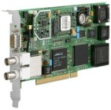

\ *hopf*\  PCI-Bus Receiver (6039 GPS/DCF77)
============================================

.. raw:: html

   

.. raw:: html

   

+--------------------------------------+--------------------------------------+
| .. rubric:: Synopsis                 | \ **                                 |
|                                      | |image0|                             |
| +----------------------------------- |                                      |
| ---+-------------------------------- |                                      |
| ------+                              |                                      |
| | .. raw:: html                      |                                      |
|    | **127.127.39.\ *X***            |                                      |
|       |                              |                                      |
| |                                    |                                      |
|    |                                 |                                      |
|       |                              |                                      |
| |    
             |                                      |
|    |                                 |                                      |
|       |                              |                                      |
| |                                    |                                      |
|    |                                 |                                      |
|       |                              |                                      |
| | ``Address:  ``                     |                                      |
|    |                                 |                                      |
|       |                              |                                      |
| |                                    |                                      |
|    |                                 |                                      |
|       |                              |                                      |
| | .. raw:: html                      |                                      |
|    |                                 |                                      |
|       |                              |                                      |
| |                                    |                                      |
|    |                                 |                                      |
|       |                              |                                      |
| |    
                          |                                      |
|    |                                 |                                      |
|       |                              |                                      |
| +----------------------------------- |                                      |
| ---+-------------------------------- |                                      |
| ------+                              |                                      |
| | .. raw:: html                      |                                      |
|    | SPHINX-LABELREFIDSPHINX-LABEL\  |                                      |
| **.ho |                              |                                      |
| |                                    |                                      |
|    | pf.**                           |                                      |
|       |                              |                                      |
| |    
             |                                      |
|    | (default)**, GPS, DCF**         |                                      |
|       |                              |                                      |
| |                                    |                                      |
|    |                                 |                                      |
|       |                              |                                      |
| | ``Reference ID:  ``                |                                      |
|    |                                 |                                      |
|       |                              |                                      |
| |                                    |                                      |
|    |                                 |                                      |
|       |                              |                                      |
| | .. raw:: html                      |                                      |
|    |                                 |                                      |
|       |                              |                                      |
| |                                    |                                      |
|    |                                 |                                      |
|       |                              |                                      |
| |    
                          |                                      |
|    |                                 |                                      |
|       |                              |                                      |
| +----------------------------------- |                                      |
| ---+-------------------------------- |                                      |
| ------+                              |                                      |
| | .. raw:: html                      |                                      |
|    | **HOPF\_P**                     |                                      |
|       |                              |                                      |
| |                                    |                                      |
|    |                                 |                                      |
|       |                              |                                      |
| |    
             |                                      |
|    |                                 |                                      |
|       |                              |                                      |
| |                                    |                                      |
|    |                                 |                                      |
|       |                              |                                      |
| | ``Driver ID:  ``                   |                                      |
|    |                                 |                                      |
|       |                              |                                      |
| |                                    |                                      |
|    |                                 |                                      |
|       |                              |                                      |
| | .. raw:: html                      |                                      |
|    |                                 |                                      |
|       |                              |                                      |
| |                                    |                                      |
|    |                                 |                                      |
|       |                              |                                      |
| |    
                          |                                      |
|    |                                 |                                      |
|       |                              |                                      |
| +----------------------------------- |                                      |
| ---+-------------------------------- |                                      |
| ------+                              |                                      |
+--------------------------------------+--------------------------------------+

.. raw:: html

   

.. raw:: html

   

Description
-----------

| The **refclock\_hopf\_pci** driver supports the
  `hopf <http://www.hopf.com>`__ PCI-bus interface 6039 GPS/DCF77.
|  Additional software and information about the software drivers maybe
  available from: http://www.ATLSoft.de/ntp.
|  Latest NTP driver source, executables and documentation is maintained
  at: http://www.ATLSoft.de/ntp

Operating System Compatibility
------------------------------

| The hopf clock driver has been tested on the following software and
  hardware platforms:
|  

+--------------------------------------+--------------------------------------+
| **Platform**                         | **Operating System**                 |
+--------------------------------------+--------------------------------------+
| i386 (PC)                            | Linux                                |
+--------------------------------------+--------------------------------------+
| i386 (PC)                            | Windows NT                           |
+--------------------------------------+--------------------------------------+
| i386 (PC)                            | Windows 2000                         |
+--------------------------------------+--------------------------------------+

O/S System Configuration
------------------------

**UNIX**

The driver attempts to open the device
**:ref:`/dev/hopf6039
<driver39-REFID>`** . The device entry will be
made by the installation process of the kernel module for the PCI-bus
board. The driver sources belongs to the delivery equipment of the
PCI-board.

**Windows NT/2000**

The driver attempts to open the device by calling the function
"OpenHopfDevice()". This function will be installed by the Device Driver
for the PCI-bus board. The driver belongs to the delivery equipment of
the PCI-board.

Fudge Factors
-------------

``:ref:`refid  <driver39-REFID>`string``
    Specifies the driver reference identifier, **GPS** *or* **DCF**.
``flag1 0 | 1``
    When set to 1, driver sync's even if only crystal driven.

Questions or Comments:
~~~~~~~~~~~~~~~~~~~~~~

`Bernd Altmeier <mailto:altmeier@atlsoft.de>`__\ `
Ing.-Büro für Software www.ATLSoft.de <http://www.ATLSoft.de>`__

