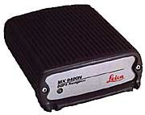

Magnavox MX4200 GPS Receiver
============================

Synopsis
--------

| Address: 127.127.9.\ *u*
| Reference ID: ``GPS``
| Driver ID: ``GPS_MX4200``
| Serial Port: ``/dev/gpsu``; 4800 baud, 8-bits, no parity
| Features: ``ppsclock`` (required)

Description
-----------

This driver supports the Magnavox MX4200 Navigation Receiver adapted to
precision timing applications. This driver supports all compatible
receivers such as the 6-channel MX4200, MX4200D, and the 12-channel
MX9212, MX9012R, MX9112.

|Leica MX9400N Navigator|

Leica MX9400N Navigator.

`Leica Geosystems <http://www.leica-gps.com/>`__ acquired the Magnavox
commercial GPS technology business in February of 1994. They now market
and support former Magnavox GPS products such as the MX4200 and its
successors.

Operating Modes
---------------

This driver supports two modes of operation, static and mobile,
controlled by clock flag 2.

In static mode (the default) the driver assumes that the GPS antenna is
in a fixed location. The receiver is initially placed in a "Static, 3D
Nav" mode, where latitude, longitude, elevation and time are calculated
for a fixed station. An average position is calculated from this data.
After 24 hours, the receiver is placed into a "Known Position" mode,
initialized with the calculated position, and then solves only for time.

In mobile mode, the driver assumes the GPS antenna is mounted on a
moving platform such as a car, ship, or aircraft. The receiver is placed
in "Dynamic, 3D Nav" mode and solves for position, altitude and time
while moving. No position averaging is performed.

Monitor Data
------------

The driver writes each timecode as received to the ``clockstats`` file.
Documentation for the NMEA-0183 proprietary sentences produced by the
MX4200 can be found in :doc:`MX4200 Receiver Data Format <mx4200data>`.

Fudge Factors
-------------

``time1 time``
    Specifies the time offset calibration factor, in seconds and
    fraction, with default 0.0.
``time2 time``
    Not used by this driver.
``stratum number``
    Specifies the driver stratum, in decimal from 0 to 15, with default
    0.
``refid string``
    Specifies the driver reference identifier, an ASCII string from one
    to four characters, with default ``GPS``.
``flag1 0 | 1``
    Not used by this driver.
``flag2 0 | 1``
    Assume GPS receiver is on a mobile platform if set.
``flag3 0 | 1``
    Not used by this driver.
``flag4 0 | 1``
    Not used by this driver.

Additional Information
----------------------

:doc:`Reference Clock Drivers <../refclock>` 

