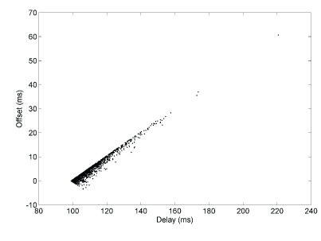

The Huff-n'-Puff Filter
=======================

In scenarios where a considerable amount of data are downloaded or
uploaded using DSL or telephone modem lines, timekeeping quality can be
seriously degraded. This occurs because the traffic volume, and thus the
queuing delays, on the upload and download directions of transmission
can be very different. In many cases the apparent time errors are so
large as to exceed the step threshold and a step correction can occur
during and after the data transfer.

The huff-n'-puff filter is designed to correct the apparent time offset
in these cases. It depends on knowledge of the propagation delay when no
other traffic is present, such as during other than work hours. The
filter remembers the minimum delay over the most recent interval
measured usually in hours. Under conditions of large delay, the filter
corrects the apparent offset using the sign of the offset and the
difference between the apparent delay and minimum delay. The name of the
filter reflects the negative (huff) and positive (puff) correction,
which depends on the sign of the offset. The filter is activated by the
``tinker huffpuff`` command, as described in the
:doc:`Miscellaneous Options
<miscopt>` page.

.. raw:: html

   

|image0|

Figure 1. Huff-n'-Puff Wedge Scattergram

.. raw:: html

   

Figure 1 shows how the huff-n'-puff filter works. Recall from the
:doc:`Clock Filter Algorithm
<filter>` page that the wedge scattergram plots
sample points (*x*, *y*) corresponding to the measured delay and offset,
and that the limb lines are at slope ±0.5. Note in the figure that the
samples are clustered close to the upper limb line, representing heavy
traffic in the download direction. The apparent offset *y*\ :sub:`0` is
near zero at the minimum delay *x*\ :sub:`0`, which is near 0.1s. Thus,
for a point (*x*, *y*), the true offset is

    | θ = *y* - (*x* - \ *x*\ :sub:`0`) / 2 for *y* > *y*\ :sub:`0` at
      or near the upper limb line or
    |  θ = *y* + (*x* - \ *x*\ :sub:`0`) / 2 for *y* < *y*\ :sub:`0` at
      or near the lower limb line.

In either case the associated delay is δ = *x*.

In the interior of the wedge scattergram far from the limb lines, the
corrections are less effective and can lead to significant errors if the
area between the limb lines is heavily populated.

